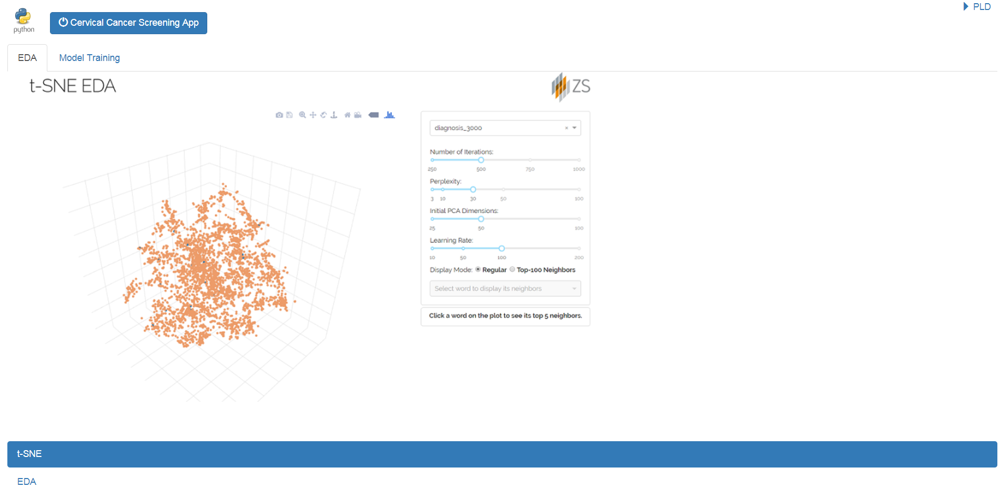
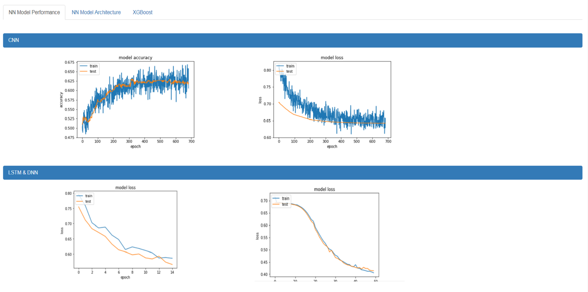
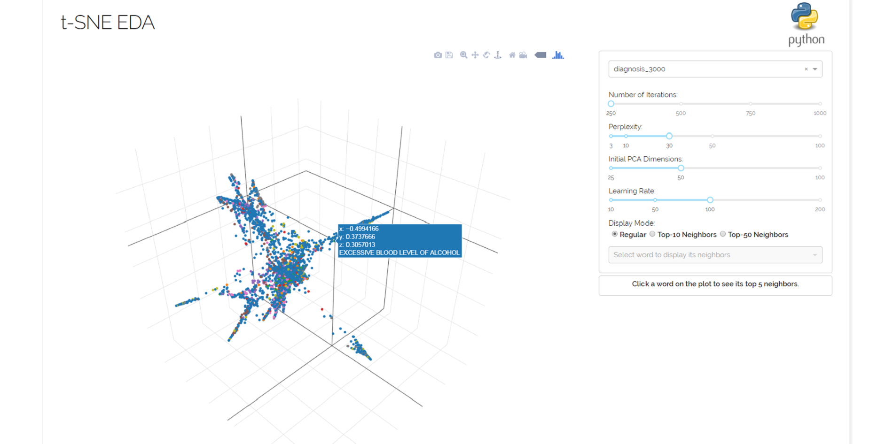
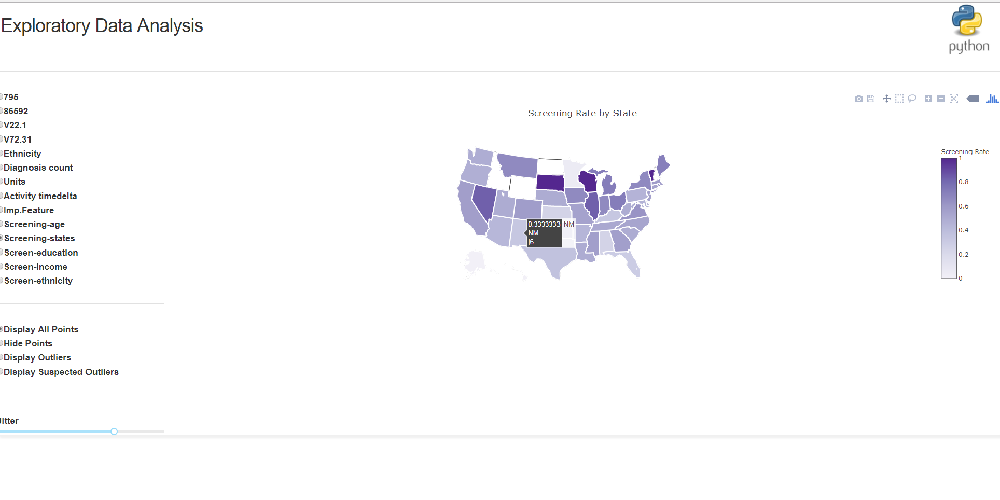

# Web UI Development with Flask and Dash 

To get started first run install_dependencies.py to install all the necessary packages required.The application uses flask as a backend server and dash/plotly for interactive EDA.Ther server is contained in server.py and the routing as well as the dash apps are handled by main.py which imports other dash apps [app.py & app8.py]. In order to run the whole application after running install_dependencies.py ,run main.py the dashboard is hosted at http://127.0.0.1:5000/dashboard/ where as other apps are hosted respectively at 

http://127.0.0.1:5000/tsne
,http://127.0.0.1:5000/model
,http://127.0.0.1:5000/app8

You can handle dash apps using flask just by calling the constructor function in the dash app by ```app=dash.Dash(name='app7', sharing=True, server=server, url_base_pathname='/app8')``` where server is the flask server that was created to handle all the apps. 

# Dashboard


# Model Performance


# T-SNE EDA


# EDA



## Built With
* [Dash](https://dash.plot.ly/) - Main server and interactive components
* [Plotly Python](https://plot.ly/python/) - Used to create the interactive plots
* [Scikit-Learn](http://scikit-learn.org/stable/documentation.html) - Run the t-SNE algorithm
* [Flask](http://flask.pocoo.org/)-backend stuff

## Will add more apps top the project such as live model training using pytorch and many more.
## All dev are welcome to contribute to the project 

